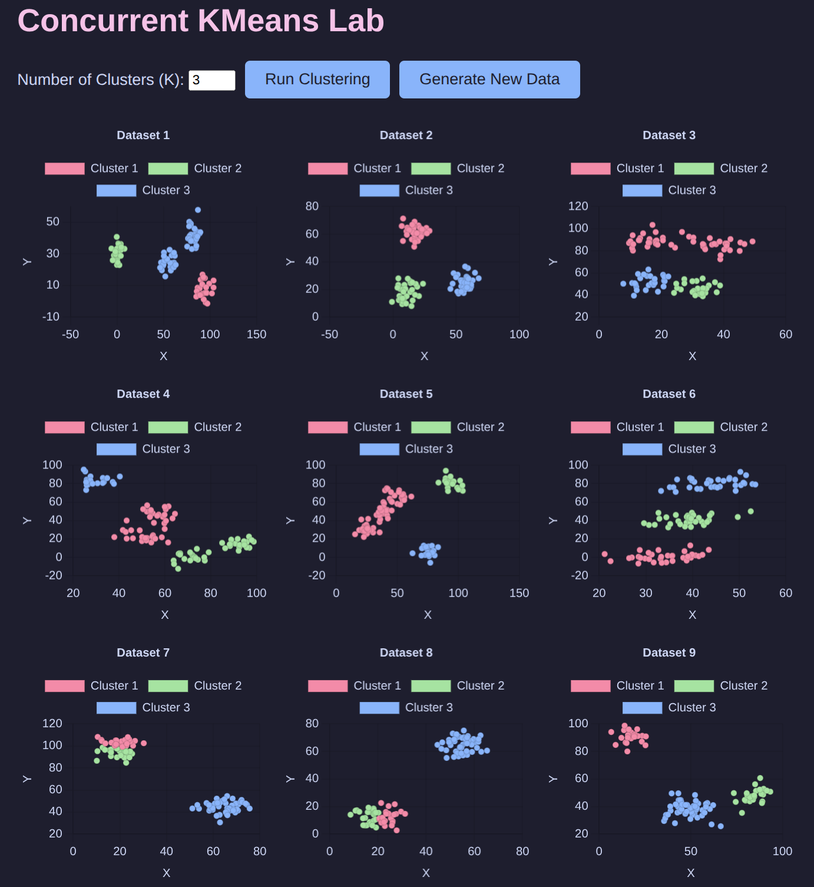

# Concurrent KMeans Lab

    [](https://go.dev/)    [](https://nodejs.org/)

An interactive web app that demonstrates **concurrent KMeans clustering** in Go.  



## 🚀 Features
- **Go Backend:** Concurrent clustering of datasets using goroutines
- **Frontend:** Node.js with vanilla JavaScript and Chart.js
- **Responsive Layout:** Charts scale nicely to different screen sizes
- **Catppuccin Mocha Theme:** Visually appealing, dark-mode friendly

## ⚙️ How it works
- 9 unique datasets generated randomly
- Dynamic selection of cluster count (K)
- Run clustering on existing data or generate new data with a single click
- Visual comparison of clustering results in a 3x3 responsive grid

## 🛠️ Getting Started

1. Clone the repo:
    ```bash
    git clone https://github.com/YOUR_USERNAME/concurrent-kmeans-lab.git
    cd concurrent-kmeans-lab
    ```

2. Build and run the Go backend:
    ```bash
    cd api
    go run main.go
    ```

3. Start the frontend:
    ```bash
    cd frontend
    npm install
    npm start
    ```

4. Visit [http://localhost:3000](http://localhost:3000) in your browser.

## 📝 License

MIT License.